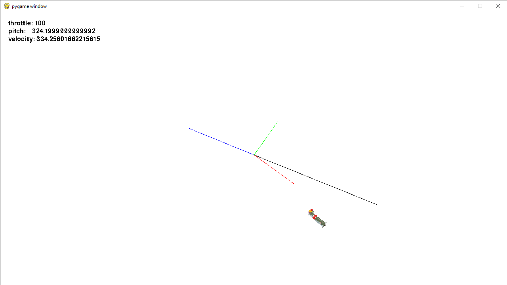

# Tupolev Gaming
By *Bas de Blok, Finn de Graaf, Max Visscher* & *Joris Heemskerk*

Created for the [Autonomy By Design (ADB)](https://canvas.hu.nl/courses/39869/pages/kennisroute-ai) cursus.

 <!--  -->
 
 # Demo video of branch

Watch the demo video by clicking on the image below:

 

## Structure code base

The simulation can be used by running main.py. 

The program uses multiple objects to create the simulation. These are **Aircraft**, **Balloon**, **Ground** and **Bullet**(Bullet is not used in the current version of the simulation).

The classes **Balloon**, **Bullet** and **Ground** are used to create the environment. **Aircraft** is the superclass of the agent. **Aircraft** contains all physic related code allowing the plane to fly realistically. The subclass of **Aircraft**, **Agent** contains the algorithms allowing the agent to function as an individual entity. 

All global variables, such as plane size, are defined in settings.py. 

